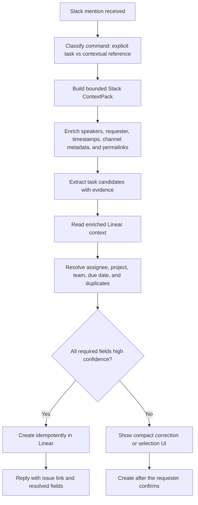

# Slack → Linear Contextual Task Creation Plan

## Implementation status (21 July 2026)

The high-confidence contextual creation path described here is now implemented across Roo and `mlai-backend`:

- Roo reads a bounded, on-demand slice of the invoking Slack channel (or the current thread), enriches speakers and timestamps, and excludes the Roo command from task evidence.
- Contextual references take precedence over the direct task parser; “for me” resolves to the requester.
- Extraction carries explicit-commitment, due-expression, and source-message evidence fields.
- Project matching uses richer live Linear metadata, linked Slack channels, recent project issues, and true project membership when supported by the workspace schema.
- Relative dates are recalculated from the evidence message's Sydney-local timestamp.
- Created issues include evidence, a Slack permalink, requester/source metadata, and a durable idempotency fingerprint.
- `mlai-backend` persists issue-creation receipts so Slack retries return the original Linear issue instead of creating a duplicate.

The existing Approve/Reject flow remains the fallback for reviewable candidates. Editable project/assignee selectors, durable review drafts, and learned channel/project bindings remain optional follow-on improvements; they are not used by the supplied high-confidence Founder Games flow.

## Goal

Let a person mention Roo in Slack with a lightweight command such as:

> `@Roo add this as a task for me in Linear`

Roo should read the relevant conversation immediately above or around that message, identify the concrete task, resolve the assignee and Linear project, create the issue when the evidence is strong, and reply with the Linear link.

The desired interaction is one step when the context is explicit. Roo should only ask for clarification or approval when a required field is genuinely ambiguous.

## Expected result for the supplied conversation

Roo should extract approximately:

- **Title:** Send Founder Games run sheet to Jess
- **Assignee:** Dr Sam, resolved from the Slack identity in the conversation/request
- **Project:** The active Linear project most strongly associated with Founder Games, resolved from live Linear context rather than guessed from the Slack channel alone
- **Due date:** The Friday represented by “EOW”, calculated from the source message timestamp in `Australia/Sydney`
- **Description context:** Jess needs the run sheet so HEX can allocate support and prepare for setup on Friday 7 August; the application close date is 6 August
- **Evidence:** “Sam can you send me through the run sheet for the founder games by EOW”
- **Source:** A permalink to Jess's Slack message, plus the channel/thread identifiers and requester

If two Linear projects are plausible, Roo should present the top choices instead of silently choosing. It should never create a generic task called “Add this to Linear”.

## Current implementation and gaps

Roo already has most of the write path in `roo-standalone/skills/linear_meeting_actions/` and `roo-standalone/roo/skills/executor.py`:

- It routes direct Linear task commands to `linear-meeting-actions`.
- It reads teams, users, active projects, labels, and open issues before writing.
- It maps Slack mentions to Linear users by email, checks duplicates, creates issues, and provides Approve/Reject buttons for review items.
- It records basic Slack source identifiers in the issue description.

The missing pieces are primarily context and resolution quality:

1. `RooAgent.handle_mention()` only calls `conversations.replies`. A top-level `@Roo` message therefore sees only itself, not the preceding channel conversation.
2. “Add this as a task …” currently satisfies both the direct-task and thread-reference detectors. The direct-task path wins, so “this” may become the task body.
3. Slack messages are passed to extraction with raw user IDs as speaker labels. The extractor does not get a clear requester profile or a reliable mapping from “Sam”/“me” to `<@U05QPB483K9>`.
4. The Linear project context is too shallow for semantic resolution. Project names, slugs, teams, latest updates, and recent issue titles are available, but project summaries/descriptions and a reliable learned alias/binding are not.
5. The current owner-based project fallback is weak: backend project “members” are enriched from the whole team, so membership is not necessarily evidence that a person belongs to a specific project.
6. Relative dates use the current processing date rather than the source message's local date and timezone.
7. Pending approvals are held in process memory. A Roo restart loses them.
8. Duplicate detection is title-based and is not an idempotency guarantee. A retried Slack event could still create the same issue twice.

## Proposed flow



## 1. Distinguish direct commands from contextual commands

Add a small deterministic intent classifier before candidate extraction:

- **Direct task:** `create a Linear task to update the run sheet`
- **Contextual explicit action:** `add this as a task`, `make that a Linear issue`, `add the above for me`
- **Contextual discussion:** `put this conversation in Linear`, where Roo must infer a follow-up from a discussion rather than copy an explicit assignment
- **Bulk extraction:** `turn these notes into Linear tasks`

Contextual references (`this`, `that`, `above`, `the conversation`, `the thread`) must take precedence over the direct-task body parser. The current command itself should be excluded from the source used to extract the work.

The supplied command is a **contextual explicit action**. It can auto-create when the preceding conversation contains a clear commitment, owner, project match, and non-ambiguous date.

## 2. Build a bounded Slack `ContextPack`

Introduce a context loader in Roo rather than putting more logic into the Linear skill itself. A normalized packet should be useful to routing and other future skills too.

Suggested shape:

```json
{
  "workspace_id": "T…",
  "channel": {
    "id": "C…",
    "name": "founder-programs",
    "topic": "…",
    "purpose": "…"
  },
  "request": {
    "user_id": "U05QPB483K9",
    "display_name": "Dr Sam",
    "email": "…",
    "message_ts": "…",
    "local_datetime": "2026-07-21T09:05:00+10:00",
    "timezone": "Australia/Sydney"
  },
  "messages": [
    {
      "user_id": "U…",
      "display_name": "Jess",
      "email": "…",
      "text": "Sam can you send me through…",
      "ts": "…",
      "thread_ts": null,
      "permalink": "https://…"
    }
  ],
  "selection": {
    "mode": "recent_channel",
    "anchor_ts": "…",
    "lookback_hours": 24,
    "truncated": false
  }
}
```

### Selection rules

1. If the mention is a thread reply, load the thread with `conversations.replies` and exclude the Roo command.
2. If it is a top-level contextual command, call `conversations.history` with `latest=<command_ts>` and `inclusive=false`.
3. Start with at most 50 prior messages and 24 hours of lookback, then select a coherent relevant subset capped by characters/tokens. The 24-hour window is important because the example conversation crosses overnight.
4. Retain a small amount of before/after adjacency around the most relevant messages so decisions and assignments are not separated from their subject.
5. If a selected root message has relevant thread replies, fetch that one thread rather than crawling every thread in the channel.
6. Exclude the current command, Roo's own responses, join/leave events, and unrelated bot noise. Preserve human-authored links and files as source metadata.
7. If no relevant context is found, ask the user to reply to the source message/thread or paste a Slack message link.

This is intentionally not “read the whole channel”. It is an on-demand, current-channel-only read with explicit limits.

### Slack API and caching

Add helpers alongside `get_thread_messages()` in `roo-standalone/roo/slack_client.py`:

- `get_recent_channel_messages(channel, before_ts, limit, oldest_ts)`
- `get_channel_context(channel)` returning name/topic/purpose
- `get_message_permalink(channel, message_ts)`
- `enrich_message_authors(messages)` using the existing cached `get_user_info()`

Cache channel metadata and user profiles. Use a short per-channel history cache to avoid repeated reads when several Roo commands arrive together. Honour `Retry-After`; if history is rate-limited, fall back to thread-only context and tell the user that the broader context was unavailable.

## 3. Resolve identity before asking the LLM

Pass human-readable but lossless speaker labels to extraction:

```text
Jess (<@UJESS>, jess@example.com): Sam can you send me through…
Dr Sam (<@U05QPB483K9>, sam@example.com): Sounds good…
Requester: Dr Sam (<@U05QPB483K9>)
```

Assignee resolution precedence:

1. Explicit Slack mention or email in the Roo command
2. “me” / “my” in the command → requester deterministically
3. Explicit assignment in the source conversation (`Sam can you…`, `@Sam will…`)
4. Exact Slack-email to Linear-email match
5. Unique full name or configured alias match
6. Otherwise require selection; do not assign by fuzzy similarity alone

This makes the example robust even if the Slack display name is “Dr Sam” and the Linear display name is “Sam Donegan”. Slack email access requires the app's `users:read` and `users:read.email` scopes.

## 4. Extract structured work with evidence

Use one structured extraction pass over the selected Slack packet. Require every candidate to contain:

- `title`
- `description`
- `owner_reference` containing the exact Slack ID/name/email evidence
- `project_terms` such as `Founder Games`
- `due_expression` and normalized `due_date`
- `evidence_message_ts` and a short evidence excerpt
- `explicit_commitment` boolean
- `confidence` with a short reason

Rules for the extractor:

- Only extract work explicitly requested, promised, or assigned.
- Do not convert general discussion or Roo's own instruction into a task.
- Keep decisions such as the application close date as supporting context, not separate tasks, unless someone was asked to enact them.
- Normalize `EOW`, `tomorrow`, and similar dates from the evidence message's local datetime, not the server clock.
- Preserve Australian date interpretation in this workspace: `6/8` is 6 August, while storing Linear dates as ISO `YYYY-MM-DD`.
- If several unrelated tasks appear in the lookback window, select the one referred to by the command or ask which task was intended.

## 5. Enrich and rank Linear project context

Extend `/api/v1/integrations/linear/meeting-context` in `mlai-backend` so Roo can match concepts, not just names.

For each active project, return the fields supported by the live GraphQL schema after an introspection check:

- name, slug, URL, status, team, lead, dates
- short summary and detailed description
- latest project update
- a small, recently updated set of issue titles for that project
- true project members if supported; otherwise omit this as a strong signal

Also make the global open-issue query explicitly ordered/filtered by recency using the current schema rather than relying on an unspecified first page.

### Project scoring

Use an evidence-based ranker with clear precedence:

| Signal | Treatment |
| --- | --- |
| Explicit project in the Roo command | Authoritative if exact and unique |
| Confirmed Slack channel/topic → Linear project binding | Very strong |
| Exact project name, slug, or confirmed alias in the conversation | Very strong |
| Match in project summary/description/latest update/recent issue titles | Strong when multiple fields agree |
| Channel name/topic/purpose match | Supporting evidence |
| Assignee is a true project member or lead | Tie-breaker |
| Assignee is merely on the project's team | Weak; never sufficient alone |

Return the top candidates with scores and evidence. Auto-select only when the top candidate clears the threshold and has a safe margin over the runner-up.

### Learned bindings

Store confirmed associations such as `Founder Games` → a Linear project, optionally scoped to a Slack channel. A binding should be learned from an explicit user choice or admin configuration, not from one silent fuzzy match. This makes future commands faster and more reliable while still supporting channels that discuss multiple projects.

## 6. Decide between one-step creation and review

Auto-create only when all of these are true:

- The requester explicitly asked Roo to create/add a Linear task.
- The source contains an explicit commitment or assignment, not merely a discussion Roo reframed.
- The assignee is deterministic or matched with high confidence.
- The project is confidently resolved with a meaningful lead over the next candidate.
- The Linear team is resolved from the project.
- The due date is either unambiguous or absent.
- No duplicate or idempotent replay is detected.

Ask for review/correction when:

- Roo inferred a follow-up from a discussion.
- More than one action could be “this”.
- The project or assignee has multiple credible matches.
- A relative date is ambiguous.
- The command would create several issues.

Upgrade the current Approve/Reject UI to show editable choices for project and assignee. For the common case, a compact message is enough:

> Create **Send Founder Games run sheet to Jess** in **Founder Program 2026**, assigned to **Sam**, due **Fri 24 Jul**?

Buttons/selectors: **Create**, **Project**, **Assignee**, **Cancel**.

## 7. Create idempotently and preserve provenance

Before writing, generate an action fingerprint from:

```text
workspace_id + channel_id + evidence_message_ts + normalized_title + assignee_id + project_id
```

Persist the fingerprint and the Slack `event_id`. The create endpoint must return the previously created issue for a replay rather than creating a second one.

The Linear description should include:

- concise task context
- the evidence quote
- clickable Slack permalink
- requester and assignee
- source message timestamp
- `_Generated by Roo from Slack context._`

After creation, Roo should reply:

> Created `<issue link>` — **Send Founder Games run sheet to Jess** · Sam · Founder Program 2026 · due Fri 24 Jul.

## 8. Persist drafts, bindings, and audit state

Move pending Linear actions out of the process-global `LINEAR_MEETING_PENDING_ACTIONS` dictionary. The backend is the preferable durable owner because it already performs Linear writes and can enforce idempotency.

Suggested records:

- `LinearActionDraft`: requester, source identifiers, bounded context snapshot/hash, extracted candidate, project/assignee options, state, expiry
- `LinearActionExecution`: fingerprint, Slack event ID, Linear issue ID/URL, status, timestamps
- `SlackLinearProjectBinding`: workspace/channel, normalized topic alias, Linear project ID, provenance, confirmation count, last used

Drafts should expire, and only the original requester should be able to approve or alter one. Do not persist unbounded channel history.

## Repository changes

### Roo repository

| File | Change |
| --- | --- |
| `roo-standalone/roo/slack_client.py` | Add bounded channel-history, richer channel metadata, permalink, pagination/rate-limit handling, and author enrichment helpers |
| `roo-standalone/roo/agent.py` | Request a `ContextPack` for contextual Linear commands and pass it through routing/execution |
| `roo-standalone/roo/router.py` | Include a small sanitized context summary so “add this” routes reliably without putting metadata in the system trust boundary |
| `roo-standalone/roo/linear_context.py` (new) | Select, normalize, enrich, and cap Slack context |
| `roo-standalone/roo/skills/executor.py` | Fix contextual/direct precedence; extract explicit action candidates; use deterministic assignee rules, project ranking evidence, source timestamps, and idempotency keys |
| `roo-standalone/skills/linear_meeting_actions/SKILL.md` | Document recent-channel context, high-confidence auto-create rules, and ambiguity behaviour |
| `roo-standalone/skills/linear_meeting_actions/client.py` | Send source/idempotency metadata and use draft/binding endpoints |
| `roo-standalone/roo/main.py` | Handle project/assignee selection actions and durable draft approval |
| Roo Slack app manifest/source of truth | Add only the read scopes required for supported conversation types and user email matching; reinstall the app |

### `mlai-backend` repository

| File | Change |
| --- | --- |
| `integrations/services/linear_meeting_actions.py` | Return richer, current-schema project context; improve recent issue ordering/filtering; enforce idempotent issue creation |
| `integrations/api_views_connectors.py` / `api_urls.py` | Add durable draft, execution, and project-binding endpoints as needed |
| `integrations/models.py` or a focused integration models module | Add action draft/execution/binding persistence and migrations |
| `integrations/tests_linear_meeting_actions.py` | Cover enriched context, idempotency, binding lookup, expiration, and requester authorization |

## Slack scopes and privacy defaults

The exact production manifest must be checked before implementation. For public/private channel support the likely minimum additions are:

- `channels:history`, plus `groups:history` for private channels
- `channels:read`, plus `groups:read` for name/topic/purpose
- existing `im:history` and `im:read` for DMs
- `users:read` and `users:read.email` for identity matching

Operational defaults:

- Read only the channel in which Roo was invoked.
- Require Roo to be a member of private channels.
- Do not subscribe Roo to every channel message merely to make this work; fetch context on demand.
- Do not log raw context text in normal application logs.
- Cap message count, age, characters, files, and thread expansion.
- Preserve source links and identity evidence, but store only bounded snapshots for pending actions.

## Test plan

### Unit tests

- Exact supplied conversation + `@Roo add this as a task for me in linear` produces one candidate: run sheet, Sam, `EOW`, `Founder Games`.
- Top-level mention reads prior channel history; thread mention reads the thread.
- The Roo command is excluded from evidence and cannot become the issue title.
- “for me” resolves to the requester; `Sam can you` resolves through enriched Slack identity/email.
- `EOW` uses the evidence timestamp and Sydney timezone, including a conversation crossing midnight.
- `6/8` is retained as 6 August in supporting context.
- Unrelated recent messages are excluded.
- Ambiguous project and assignee matches do not auto-create.
- A semantic project match uses project summary/update evidence and requires score separation.
- Slack history failure/rate limiting falls back safely.
- Duplicate Slack event and repeated command return the existing issue.
- Pending selection cannot be actioned by another Slack user and survives a Roo restart.

### Routing evaluation

Add cases for:

- `add this as a task for me in linear`
- `make Jess's request above a Linear issue`
- `put that in Linear and assign it to me`
- negative: `what does this Linear issue mean?`
- negative: `can you summarise the conversation?`

### Integration tests

- Mock Slack `conversations.history`, `conversations.replies`, `users.info`, `conversations.info`, and `chat.getPermalink`.
- Mock a Linear workspace with two similarly named projects and verify clarification.
- Verify the full Linear mutation contains the correct team, project, assignee, due date, provenance, and idempotency key.
- Exercise Create/Project/Assignee/Cancel Slack actions against durable drafts.

### Staging acceptance test

1. Post the supplied conversation in a staging channel as top-level messages.
2. Post `@Roo add this as a task for me in Linear` as a new top-level message.
3. Confirm Roo identifies the run-sheet action rather than its own command.
4. Confirm the resolved project/assignee/due date and source link.
5. Repeat the command and replay the Slack event; confirm only one Linear issue exists.
6. Restart Roo during an ambiguity prompt; confirm the pending action still works.

## Delivery phases

### Phase 1 — Context-aware MVP (1–2 days)

- Add recent-channel context loading and identity enrichment.
- Fix contextual/direct command precedence.
- Pass source timestamps and permalinks.
- Add the supplied conversation as a regression fixture.
- Keep current review-first behaviour for contextual actions during initial staging.

### Phase 2 — Reliable one-step creation (1–2 days)

- Add deterministic requester/assignee resolution and source-relative dates.
- Add richer project context and ranked project evidence.
- Permit auto-create for explicit, high-confidence contextual assignments.
- Improve the Slack response to show resolved fields.

### Phase 3 — Durable corrections and learning (2–3 days)

- Persist drafts/executions and enforce idempotency.
- Add project and assignee selection controls.
- Add confirmed topic/channel project bindings.

### Phase 4 — Hardening and rollout (1 day)

- Add rate-limit handling, bounded caches, metrics, privacy-safe logs, and production scope checks.
- Run routing regression and end-to-end staging suites.
- Roll out behind `LINEAR_CONTEXTUAL_TASKS_ENABLED`, then enable high-confidence auto-create separately.

Estimated total: **5–8 engineering days**, with a useful review-first MVP after the first 1–2 days.

## Acceptance criteria

The feature is complete when:

- The exact example works from a new top-level Slack mention without pasting the conversation into a thread.
- Roo resolves the task and Sam's identity from context, not from hard-coded names.
- Roo can justify its selected Linear project from live project metadata or a confirmed binding.
- High-confidence explicit assignments create in one step; ambiguous cases present useful choices.
- Relative dates are anchored to the source message in the workspace timezone.
- Every created issue has a Slack permalink and evidence.
- Slack event retries and repeated commands cannot create duplicates.
- Context access is bounded to the invoking conversation/channel and raw history is not logged.
