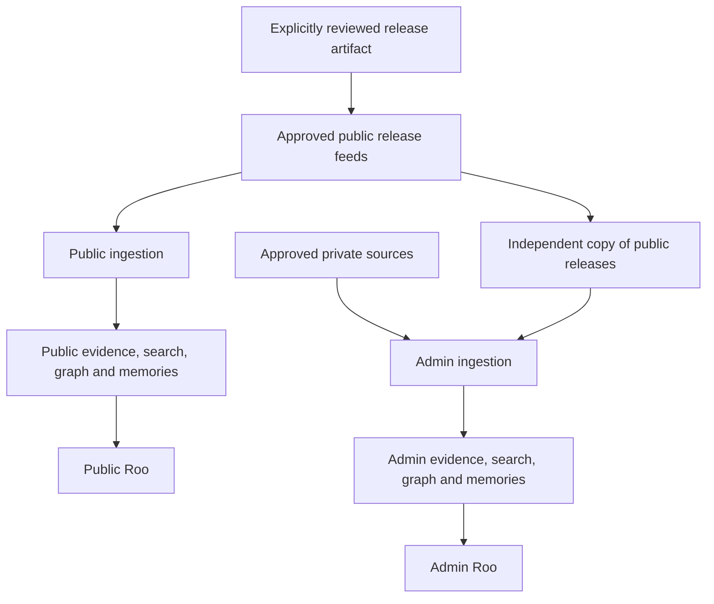

**Roo company brain — current state, architecture and delivery plan**

Historical review prepared 30 September 2026; preserved during the 3 October release audit. The observations below describe the pinned releases and inspection time, and must be reassessed before implementation.

Prepared 30 September 2026. Live database metadata checked at 10:17 am Australia/Sydney. This is a proposed plan, not a release approval or a record of changes to production.

Roo has a working private company-memory foundation. It already combines PostgreSQL, vector search, keyword search and a structured graph of evidence-backed facts. The immediate work is to make the two audiences truly independent, broaden the sources, and turn the existing machinery into a dependable everyday product.

The current production brain is a narrow committee-meeting pilot. It does not yet have broad knowledge of MLAI's governance documents, public activity, people, products and daily work. Public Roo has no populated company-knowledge corpus. A substantial part of the required engine exists already; this should be an extension and isolation project rather than a replacement.

**What I verified**

I inspected Roo and the sibling backend, compared relevant code against current GitHub releases, read the latest successful deployment logs, and queried aggregate production metadata inside read-only database transactions. I did not retrieve document contents or run ingestion, repairs, migrations, deployments or Slack actions. Existing unrelated local edits were left intact.

Latest successful deployment evidence: [backend release bf6a7cf](https://github.com/MLAI-AUS-Inc/mlai-backend/actions/runs/36568200084) and [Roo release c105c6e](https://github.com/MLAI-AUS-Inc/roo/actions/runs/36573728843), both on 29 September. The repository checkouts are older and contain unrelated changes; deployment evidence and live metadata take precedence for statements about production. The relevant memory implementation was unchanged between the inspected backend reference and current release.

The content-free [live snapshot](2026-09-30-live-snapshot.json) records the observed timestamps and counts. It is an audit snapshot, not ongoing monitoring.

| Question | Verified answer |
| --- | --- |
| Last successful sync/check | **30 September, 10:01:47 am Sydney**. Seven pages checked; zero records processed. About 16 minutes before inspection. |
| Last completed sync that processed records | **23 September, 5:06:24 am Sydney**. Two records processed; about one week before inspection. |
| Latest source capture | **23 September, 5:04:01 am Sydney**. This confirms that the recent checks have not added a newer source version. |
| Latest embedding / successful extraction | **23 September, 5:05:37 am / 5:06:19 am Sydney**. |
| Active company-memory connections | **One: Google Drive.** The latest deployment report identifies two selected source scopes. |
| Usable source coverage | **96 active meeting-transcript sources**, with 187 source versions including history. |
| Searchable evidence | **1,280 active passages**, all with full-text indexes and current embeddings. |
| Structured facts | **71 active claims**, 2,521 candidate claims requiring review, three stale claims and 159 archived claims. Candidate counts are not approved facts; source passages have their own retrieval path. |
| Public company knowledge | **Zero public knowledge items**, and the public publication/answer feature is disabled. |

The deployment report also counted 191 active Drive inventory artifacts, including 95 unsupported items. Inventory discovery is not usable knowledge. The live source count above is the more meaningful measure. Likewise, a successful check today does not mean Roo knows everything that happened today.

**How data, context and memories work today**

The long-term brain lives in `mlai-backend`, not in Roo's Slack process. The model receives selected evidence for each question; the application stores and retrieves the knowledge.

| Layer | Current implementation | What it does |
| --- | --- | --- |
| Evidence | PostgreSQL source records, immutable versions, verbatim chunks and source permissions | Preserves what a document said and where the statement came from. |
| Keyword retrieval | PostgreSQL full-text search with GIN indexes | Finds exact names, terminology and phrases. |
| Semantic retrieval | pgvector; 1,536-dimensional `text-embedding-3-small` vectors and HNSW indexes | Finds passages with similar meaning. Live vectors are present for all active chunks. |
| Structured knowledge | Entities, subject–predicate–object claims, links, validity dates and current-state projections | Represents people, projects, ownership, decisions and changes over time. This is a relational knowledge graph, not a separate Neo4j database. |
| Derived knowledge | Extraction, consolidation, summaries, review records and feedback | Proposes and maintains evidence-backed memory while preserving history and contradictions. |
| Conversation context | Recent Slack history, an in-process routing cache and SQLite session/workflow metadata | Helps with follow-up questions. The routing cache expires after 30 minutes; SQLite session metadata does not store message text. |
| Personal / conversational memory | No general persistent, governed “remember this” mechanism in Roo | Chatting with Roo does not automatically create a reliable long-term company memory. Admin Roo is currently read-only. |

Private retrieval combines structured facts and source text/vector results, filters permissions and lifecycle state, checks evidence sufficiency, and produces an answer or abstains. The relevant implementation is in [memory models](https://github.com/MLAI-AUS-Inc/mlai-backend/blob/bf6a7cf0c8b3a2698626556b6da8d419a87a4eb6/org_memory/models.py), [retrieval](https://github.com/MLAI-AUS-Inc/mlai-backend/blob/bf6a7cf0c8b3a2698626556b6da8d419a87a4eb6/org_memory/retrieval.py) and the [retrieval contract](https://github.com/MLAI-AUS-Inc/mlai-backend/blob/bf6a7cf0c8b3a2698626556b6da8d419a87a4eb6/docs/org-memory-retrieval.md).

Connectors are implemented for Drive, Slack, Linear, Notion, Gmail and structured Stripe/Xero/Luma aggregates. Only Drive is approved in the checked-in provider policy, and only Drive appears in the live company-memory configuration. Other Roo skills may query those services for particular tasks; that is separate from importing them into the company brain. The current Drive processing path specifically looks for meeting-transcript candidates, so ordinary governance, policy and product documents need a broader document pipeline. See [provider policy](https://github.com/MLAI-AUS-Inc/mlai-backend/blob/bf6a7cf0c8b3a2698626556b6da8d419a87a4eb6/org_memory/policies/provider_policies.json) and [Drive processing](https://github.com/MLAI-AUS-Inc/mlai-backend/blob/bf6a7cf0c8b3a2698626556b6da8d419a87a4eb6/org_memory/drive_processing.py).

**Where the current separation falls short**

Existing protections are useful: different public/admin runtime credentials and volumes, a private read-only Admin worker, signed single-use dispatch, destination checks, and permission-aware backend retrieval. Public configuration rejects the private memory credential.

Those protections do not satisfy the new requirement for independent knowledge and memories:

1. **One Slack identity handles both audiences.** Public Roo routes the private question and posts the private response. There is no separately identifiable Admin Roo app in the current production design.
2. **Internal answers can be delivered to public Slack channels.** The current policy permits approved committee actors to do this with a warning banner. The latest production access report confirms the public-channel admin scope. A banner does not restrict the audience.
3. **Shared thread history creates a contamination path.** Skipping an Admin thread's history depends on a temporary in-process routing hint. After expiry, restart or a skill switch, earlier Admin replies can be fetched into a general Public Roo context. This is a static code finding; this audit did not establish that an actual disclosure occurred.
4. **The public process sees private query text before authorization.** It sends the question through its routing model and logs question snippets. Current redaction removes recognizable identifiers and secrets, not all confidential prose.
5. **Public and private backend tables share the default database.** The public table has its own text/vector fields and no foreign keys to private evidence, and its retrieval has no private fallback. That is valuable logical isolation, but not independent database authority.
6. **“Public Roo” currently describes an operational runtime, not a purely public dataset.** It also hosts some role-filtered business skills. Those tools need an audience and permission audit before the name can imply that everything the runtime can access is public.

Code evidence: [runtime routing and thread handling](https://github.com/MLAI-AUS-Inc/roo/blob/c105c6e12fc577d972856f4f18f8b83e587eb480/roo-standalone/roo/agent.py), [logging redaction](https://github.com/MLAI-AUS-Inc/roo/blob/c105c6e12fc577d972856f4f18f8b83e587eb480/roo-standalone/roo/logging_safety.py), [deployment contract](../admin-roo-deployment.md), and [public publication design](https://github.com/MLAI-AUS-Inc/mlai-backend/blob/bf6a7cf0c8b3a2698626556b6da8d419a87a4eb6/docs/org-memory-publication.md).

**What other companies are converging on**

The sources below describe vendor implementations or published research, not independent proof of their security or product performance.

| Example | Documented approach | Lesson for Roo |
| --- | --- | --- |
| [Glean](https://docs.glean.com/connectors/connectors-power-glean) | Connectors bring content, identity, permissions and metadata into an index and Enterprise Graph, with indexed and live retrieval patterns. | Source connectivity, access and relationships matter as much as the model. |
| [Atlassian Rovo / Teamwork Graph](https://support.atlassian.com/organization-administration/docs/manage-your-teamwork-graph-connectors/) | Synced connectors, live API connectors and permission-based Smart Links; connector health is visible. | Index stable knowledge and use authorized live reads for fast-changing facts. Show sync health. |
| [Notion Enterprise Search](https://www.notion.com/help/enterprise-search-security-and-privacy-practices) | Embeddings in a vector store, query-time permissions and source-permission synchronization. | Vectors do not replace authorization. Permission changes and deletion have operational delays to measure. |
| [Anthropic Contextual Retrieval](https://www.anthropic.com/engineering/contextual-retrieval) | Context attached to chunks, semantic retrieval, keyword retrieval and reranking. | Improve retrieval quality with source context and evaluations; Roo already has the hybrid foundation. |
| [Microsoft Research GraphRAG](https://www.microsoft.com/en-us/research/project/graphrag/) | Extracted relationships and graph-based summaries support questions spanning a corpus. | Expand graph reasoning for ownership, connections and decision history when real questions justify it. This is not a claim about Microsoft 365 Copilot's exact implementation. |
| [Anthropic's memory tool](https://platform.claude.com/docs/en/agents-and-tools/tool-use/memory-tool) | Persistent memory is stored and controlled by the application. | Memory requires explicit ownership, write rules, storage isolation and lifecycle management. |

My synthesis is a company brain with **source evidence + hybrid retrieval + structured relationships + scoped memory + authorized tools**. Roo is already heading in that direction. The strongest next investment is operating and completing that architecture, rather than buying another vector store or rebuilding around a graph database.

**Recommended target: two independently secured brains using the same engine**

Public Roo and Admin Roo should have separate app identities or clearly separate authenticated endpoints, deployments, databases and database roles, source credentials, object storage, queues, conversation stores, memory stores, caches, model-provider projects where supported, traces, logs and backups. Use network rules and infrastructure access controls so Public Roo cannot reach Admin storage. For the strongest boundary, use separate infrastructure projects and database instances. A shared codebase is fine; a shared data-bearing runtime or credential is not.

Choose the audience from the verified app/endpoint/session before any language-model call. A user cannot switch into Admin by asking in Public Roo. Start Admin Roo in authorized DMs. A private channel is not sufficient on its own: later channel delivery must authorize the entire destination audience against the evidence being used. Apply per-user source permissions inside Admin too: committee membership should not automatically grant access to every people-sensitive record. Derived facts, summaries and memories inherit their sources' restrictions.

Each brain independently extracts facts and forms memories from its own approved evidence. Both may know the same published announcement because each ingested that public artifact. Public must never query, copy, summarize or reuse Admin's conversation history, internal summaries, embeddings, inferred facts or memories. If a private fact is intentionally released, the reviewed and redacted release becomes a new public source with public provenance. The publication process needs narrow permissions and its own audit trail; Public Roo gets no access back into the private store.

Working assumption: Public Roo initially serves the MLAI community. “Public to Slack members” and “public on the internet” must remain distinct audience classifications. If both audiences are required, use independently authorized public collections or an additional deployment. The existing public endpoint permits anonymous use when enabled; it needs authentication if its corpus is community-only.

**Source policy for MLAI**

| Information | Public Roo | Admin Roo |
| --- | --- | --- |
| Website, released event pages, published marketing/social posts | Ingest the published version automatically from approved feeds. | May ingest its own copy. |
| Public Slack channels | Only explicitly approved channels/content for the intended audience. Exclude private links, attachments and accidental disclosures. | Approved channels subject to actor/source permissions. |
| Public projects, repositories and release notes | Only selected projects and released material. | Approved internal and public projects. |
| Selected inboxes | Only approved messages or labels that are actually releasable; an inbox address does not make replies or attachments public. | Selected business inboxes with explicit scope and retention. |
| Committee meetings and private Slack channels | No ingestion. | Approved scopes with source permissions. |
| Governance and policy documents | Only an intentionally published edition. | Current authoritative versions and relevant history. |
| People | Approved public roles, bios and contact routes. | Role-scoped internal context; no unrestricted people dossier. |
| Finance and transactions | Reviewed public figures only. | Scoped structured aggregates and authorized live queries. |

Every source registration should have an owner, audience, approved scope, document type, retention rule, freshness target and authority level. Default unknown sources to excluded. Preserve the distinction between a proposal, a decision and a published policy. Retrieval authority should consider document approval and effective dates rather than trusting the newest Slack message.

Use event-driven ingestion where available, with daily reconciliation for missed changes. For low-risk, already-published feeds, source-policy approval can automate ongoing ingestion. Material crossing from private to public requires a reviewable release artifact. On edits, deletion or revoked access, invalidate dependent passages, embeddings, facts, summaries, memories and answer caches. Do not let bot-generated replies re-enter the corpus as independent corroboration. Before a public backfill, identify and quarantine any historical Admin replies and private-derived material in otherwise approved channels; public channel visibility must never reclassify that content as approved public evidence.

**The features that would make Roo useful every day**

- **MLAI context cards:** concise, owned and dated records for purpose, governance, working practices, people and roles, projects, products, technology, events, terminology and priorities. Maintain separate public/admin versions from their own sources.
- **“What changed?”:** a daily view of new decisions, event changes, project movement and stale information, with links to evidence. Sending a digest is a separately configured action.
- **“Why did we decide this?” and “Who owns this?”:** temporal decision history and entity relationships, grounded in source passages.
- **“What do you know about this?”:** a coverage view showing which sources Roo has, when they were checked and where knowledge is missing. Public views must not reveal private source existence.
- **“Show your sources”, “That is wrong”, “Remember this” and “Forget this”:** natural controls with clear scope, review status and correction/retirement behavior.
- **A review inbox:** cluster duplicate candidates, prioritize consequential/current facts and route them to domain owners. Start by sampling the 2,521 candidate claims; do not bulk-approve them.
- **A source-health dashboard:** separate last check, last content change, last indexed/embedded/extracted time, coverage, unsupported items, backlog and failure reasons.
- **Authorized live tools:** use source APIs for current event availability or operational state; knowledge answers and actions remain separate, explicitly controlled capabilities.

Memory should have three scopes: conversation continuity, a user's preferences, and reviewed organizational knowledge. A Public Roo user's preference stays private to that user within the Public system; it does not become shared public knowledge. “I prefer short replies” can be a preference. “We changed the governance process” becomes a proposed fact requiring authoritative evidence. Store audience, owner, provenance, effective dates, confidence, status and expiry/review time. Provide inspection, correction, deletion and supersession. Preserve permitted revision history for ordinary corrections; hard deletion must remove content and derivatives according to retention policy, retaining only permissible audit metadata. Backup restoration must reapply deletion records before serving restored data.

**Conversational behavior**

Both versions should sound like a helpful MLAI teammate: answer first, use ordinary words and short sentences, and add detail when asked. Avoid forced jokes, roasts and excessive Australian slang. Keep evidence links available without turning every reply into a report. Mention stale evidence or uncertainty when it affects the answer.

Illustrative style: “The latest notes say we're aiming for October. I couldn't find a confirmed date yet.” Or: “I can see the published event details, but I don't have the committee discussion.” A refusal should not reveal whether a particular private document exists.

The Admin answer prompt already asks for this style. Public Roo's generic persona is also broadly aligned, but the new public-brain endpoint currently assembles stored paragraphs rather than providing the same conversational synthesis. Unify the presentation contract and evaluate it on real MLAI questions.

**Delivery sequence**

The estimates below are planning ranges for one dedicated engineer with regular input from a knowledge owner and a reviewer. Budget roughly seven to ten weeks for the sequence below, then expand based on measured gaps. Some work can overlap after isolation is proven. Connector authorization, document quality and human review capacity can change that estimate.

| Priority / phase | Work and ownership | Completion evidence |
| --- | --- | --- |
| P0 — boundary design and containment, 2–3 days | Engineering/security: prepare the change that blocks Admin output in community channels; separate ingress before model routing; audit privileged “Public” skills, thread history and logs; inventory and quarantine historical private-derived replies before public backfill. Knowledge owner confirms audience rules. | Reviewed data-flow map; no public destination for private answers; historical contamination excluded from public ingestion; regression cases for restart, expired cache and skill switching. Deploy only through the normal reviewed release process. |
| P1 — independent deployments and state, 1–2 weeks | Engineering: isolate databases/roles, storage, workers, queues, credentials, conversations, memories, logs and backups. Preserve existing private corpus. Design any required migration separately and obtain approval for that exact migration. | Public credentials cannot access Admin resources at network/database layers; private canary content never appears through public retrieval, history, caches, tools, traces or errors. Restore and deletion paths retain the boundary. |
| P2 — reliable source coverage, 1–2 weeks | Engineering plus domain owners: expand Drive beyond transcripts; add scoped Slack, project/Linear and selected Notion sources; establish published website/event/social feeds. Add inboxes only after message-level rules are clear. Reuse existing connector machinery. | An approved inventory for every enabled source; backfill counts reconcile; updates/deletions/permission changes tested; dashboard distinguishes checked/imported/indexed/ready. |
| P3 — useful answers in both versions, about 1 week | Engineering/product: populate separate MLAI context cards; wire Public Roo to its own retrieval; add conversational synthesis; tune hybrid ranking and context using a fixed question set. | Correct, understandable answers across purpose, governance, events, people, tech, products, projects and working practices, each supported by permitted current evidence. |
| P4 — governed memory and review, 1–2 weeks | Engineering plus knowledge owners: scoped remember/forget/correct flows, provenance and expiry; review inbox; repair duplicate/stale claim handling; release-artifact workflow. | Preferences never become shared facts; unverified chat does not change policy; public memories derive only from public-side evidence; corrections invalidate dependent outputs. |
| P5 — pilot and release gate, at least 7 days | Independent reviewer plus operations: daily operational checks and a representative question audit for each audience; measure quality, freshness, cost and latency; expand only after passing. | Signed-off evidence against the existing pilot rubric plus new isolation/memory tests. Rollback can disable one brain without exposing or damaging the other. |

These are proposed work packages, not completed features. No Linear issues, scheduled tasks, migrations or deployment changes were created during this audit.

**How to judge whether it is ready**

Build a versioned set of at least 100 realistic MLAI questions spanning the eight context areas, historical/current questions, conflicting evidence, missing answers and adversarial instructions in sources. Keep the release evaluation separate from the tuning set and have domain owners review answers.

Retain existing approved policy floors; do not weaken them. Useful additional proposed gates are: zero observed cross-audience or cross-user disclosures across the boundary suite; at least 95% supported factual statements in the audited answer set; no unsupported governance decisions or private claims in public answers; appropriate abstention when evidence is absent; and a clearly measured p95 response-time target, initially 10 seconds for ordinary questions. Passing tests demonstrates controls, not a guarantee that disclosure is impossible.

The existing provider policy already targets verified webhook changes within 10 minutes p95, Slack threads within 15 minutes after quiet, polled sources within 24 hours p99, and notified access revocations within 15 minutes p95. Instrument those targets end to end, including extraction and search readiness. Immediately block locally known revoked sources; treat unknown or expired permissions as unavailable. Keep daily reconciliation and escalate material failures rather than sending repetitive healthy-status messages.

Implement cost metering before expanding ingestion. The checked-in policy lists AUD 25/day and AUD 500/month ceilings, but the latest deployment report had pricing unconfigured and a zeroed cost ledger. That is not proof of zero provider spend. Validate actual metering, approval and pause behavior before using those budgets operationally.

The first implementation milestone should be **two isolated, source-backed assistants that reliably answer a small but representative MLAI question set**. Broader graphs, personalization and autonomous actions should follow demonstrated needs. The existing PostgreSQL/pgvector/temporal-claim foundation is sufficient for that milestone.
